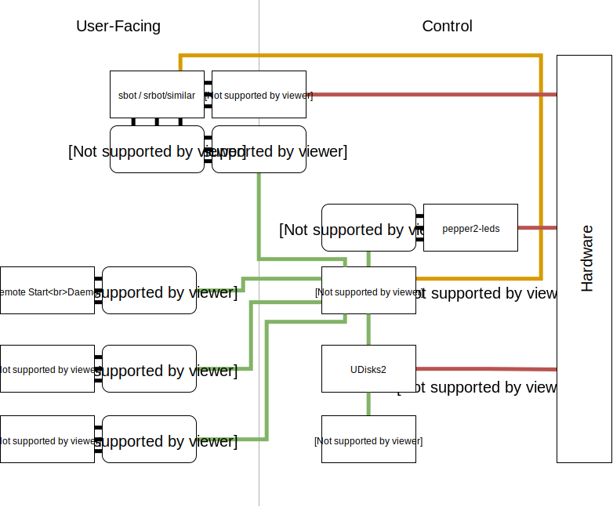

# pepper2

Robot Management Daemon

## Dependencies

- Python 3.6+

## Running

There are two programs in this repo, with shared code between them.

- `pepperctl`
    - CLI tool that talks to pepperd over HTTP, using the `pepper2.api` client.
- `pepperd`
    - Registers the USBs.
    - Triggers run and stop events for USBs, based on a set of conditions.

## Usage

`pepperd` should be run in the background as a daemon using systemd.

Usercode `main.py` on the drive will begin execution, `stdout` and `stderr` will be logged to `log.txt`.

- View daemon status: `pepperctl status`
- View usercode status: `pepperctl usercode status`
- Kill usercode: `pepperctl usercode kill`
- Start usercode on already inserted drive: `pepperctl usercode start`

## Future Development

The above diagram shows how a typical system using `pepper2` would work.

### Core Components

Core Components are essential to use `pepper2`. They are all included in this repo.

- `pepper2`
    - Python library to interact with `pepper2-daemon`
    - Abstracts from the user.
- `pepper2-daemon`
    - Performs actions based on conditions defined in a config.
        - Manages a usercode process
    - Provides "metadata" that can be accessed.
        - e.g `USERCODE_DIR`, `ARENA`, `START_TRIGGER_STATE`
- `pepper2-cli`
    - Simple wrapper around `pepper2.api`
    - Allows control of daemon from CLI for debugging and bash scripts.

## Additional Components

- `pepper2-usercode`
    - Common components that may be useful for usercode processes to interact with `pepper2`
    - For example, wait for start.
- `pepper2-leds`
    - Listens to signal events from `pepper2-daemon` and manipulates GPIO pins according to a config.
- `pepper2-servohack`
    - Listens to signal events from `pepper2-daemon` and resets the USB bus. Workaround for [bug in SR SBv4](https://github.com/srobo/servo-v4-fw/issues/7)

## Contributions

This project is released under the MIT Licence. For more information, please see LICENSE.

The CONTRIBUTORS file can be generated by executing CONTRIBUTORS.gen. This generated file contains a list of people who have contributed to Pepper2.

## Etymology

No, it's not version 2.

Spelling is `pepper2`, much like `j5`. No capitals necessary.

