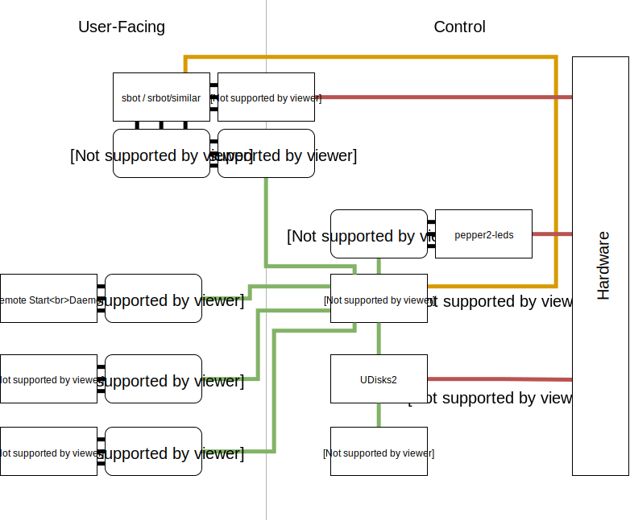

# pepper2

Robot Management Daemon

## Dependencies

Some of the dependencies for pepper2 are not available on PyPI.

- [GLib](https://developer.gnome.org/glib/) 2.46+
- [girepository](https://wiki.gnome.org/Projects/GObjectIntrospection) 1.46+
- UDisks2
- udiskie or similar automounting daemon that uses udisks2.
- D-Bus

These packages can usually be found on systems with a desktop interface anyway.

## Running

There are two programs in this repo, with shared code between them.

- `pepperctl`
    - CLI tool that talks to pepperd over D-Bus.
- `pepperd`
    - Daemon that sits on the System Bus
    - Listens for mount and cleanup events from UDisks
    - Registers the USBs.
    - Triggers run and stop events for USBs, based on a set of conditions.
    
In order to run `pepperd`, we need to tell D-Bus that we have permission to create a service on the System Bus.
This can be done by placing a config file in `/etc/dbus-1/pepper2-bus.conf`.

## Future Development



The above diagram shows how a typical system using `pepper2` would work.

### Core Components

Core Components are essential to use `pepper2`. They are all included in this repo.

- `pepper2`
    - Python library to interact with `pepper2-daemon`
    - Abstracts D-Bus from the user.
- `pepper2-daemon`
    - Daemon that listens for events from UDisks2.
    - Performs actions based on conditions defined in a config.
        - Manages a usercode process
    - Provides "metadata" that can be accessed.
        - e.g `USERCODE_DIR`, `ARENA`, `START_TRIGGER_STATE`
- `pepper2-cli`
    - Simple wrapper around `pepper2`
    - Allows control of daemon from CLI for debugging and bash scripts.

## Additional Components

- `pepper2-usercode`
    - Common components that may be useful for usercode processes to interact with `pepper2`
    - For example, wait for start.
- `pepper2-leds`
    - Listens to signal events from `pepper2-daemon` and manipulates GPIO pins according to a config.
    
## Development Resources

This program makes heavy use of D-Bus, which is not the simplest thing in the world to understand.

- [DBus Overview](https://pythonhosted.org/txdbus/dbus_overview.html)
- [D-Feet](https://github.com/GNOME/d-feet)

### Example D-Bus Config:

```xml
<!DOCTYPE busconfig PUBLIC
          "-//freedesktop//DTD D-BUS Bus Configuration 1.0//EN"
          "http://www.freedesktop.org/standards/dbus/1.0/busconfig.dtd">
<busconfig>
  <policy user="root">
    <allow own="uk.org.j5.pepper2"/>
  </policy>

  <policy context="default">
    <allow send_destination="uk.org.j5.pepper2"/>
    <allow receive_sender="uk.org.j5.pepper2"/>
  </policy>
</busconfig>

```

## Contributions

This project is released under the MIT Licence. For more information, please see LICENSE.

The CONTRIBUTORS file can be generated by executing CONTRIBUTORS.gen. This generated file contains a list of people who have contributed to Pepper2.

## Etymology

No, it's not version 2.

Spelling is `pepper2`, much like `j5`. No capitals necessary.


